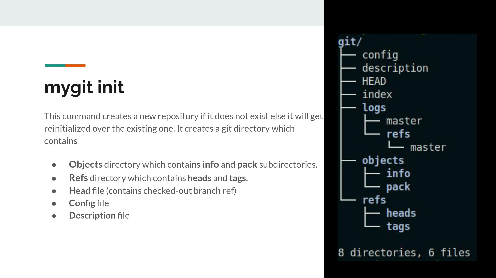
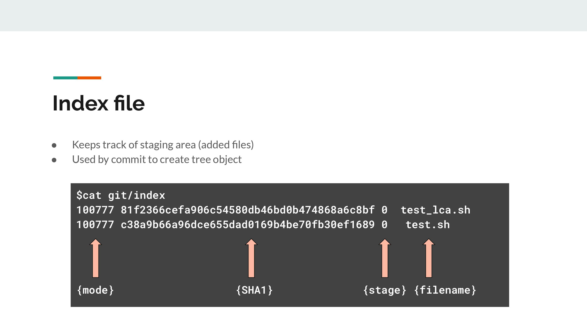
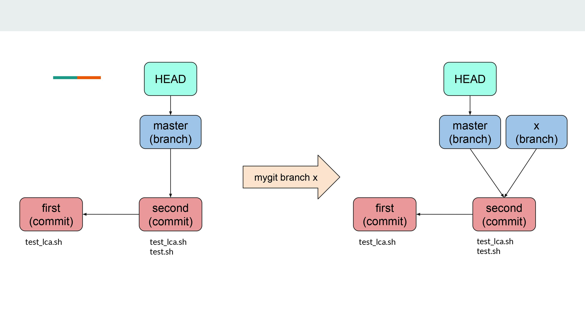
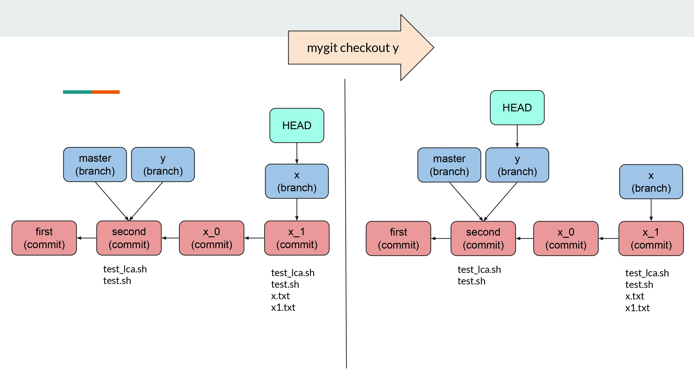
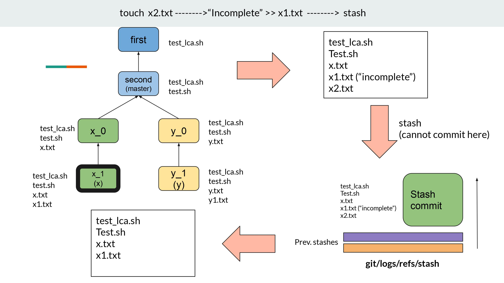
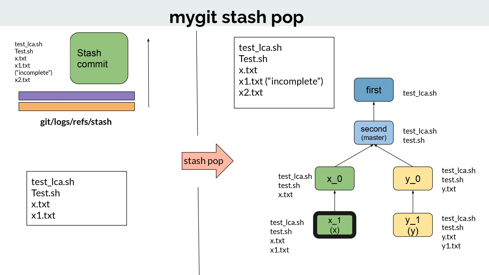
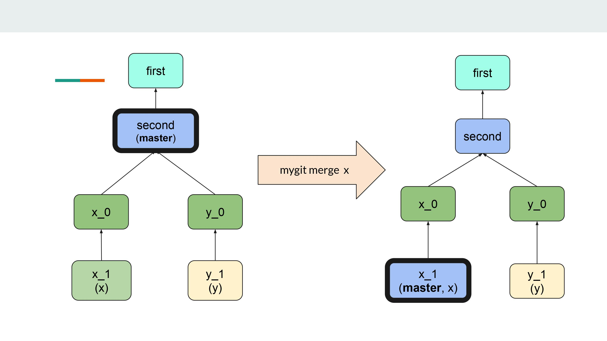
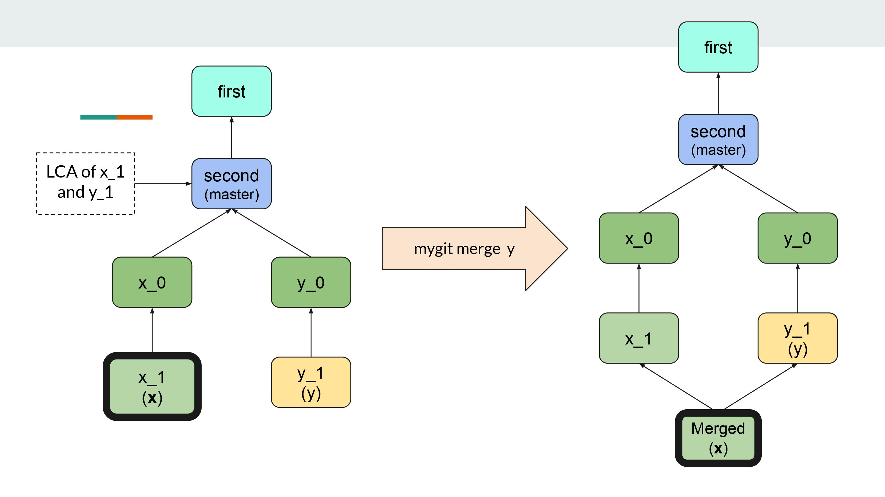
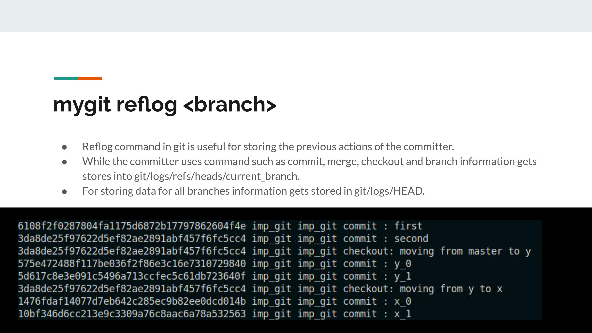

# **mygit** (simple git implementation)

This is our implementation of git using C and C++. 
We have implemented the following commands (flags not included):-

- init
- add
- commit
- branch
- checkout
- merge
- log
- reflog
- stash
- reset
- included support for ".gitignore" file

## Git objects
Everything in git is stored in form of objects.
There are mainly 3 types of objects:-

- blob
- tree
- commit


## **mygit** init
Initialise a new git repository 


## **mygit** add <dir/file>
Add files to staging area.


## Index file
File to represent the staging area


## **mygit** commit -m "commit message"
Commit the changes in staging area. A new commit object and tree structure is created accordingly.


## **mygit** branch <branch_name>
Create a new branch, if not specified print all branches

## **mygit** checkout <branch_name>
Checkout to the branch_name

## **mygit** stash -m "stash message"
Stash the contents of staging area if we do not want to commit
``` stash ```

``` stash pop```


## **mygit** merge <branch_name>
Merge the contents of current branch with the branch specified
```Fast Forward Merge```

``` Three Way Merge```

## **mygit** log 
Gives the information about all the commits done by the user of current branch.

## **mygit** reflog
Gives information about merges, checkouts, commits done by user till that point.



### Setup
#### clone the project --
```
git clone https://github.com/UrvishkumarPatel/mygit.git
```
#### Install **mygit** 
```
 make
```


### Usage

-  [x] **mygit init** :-Initialises a new git reposistory.
-  [x] **mygit add <dir/file>**:-Adds the file in the stagging area(Index file).
-  [x] **mygit commit -m "commit message"**:-Commits the added file with the message given.
-  [x] **mygit branch <branch_name>**:- Creates a new branch with branch name.
-  [x] **mygit checkout <branch_name>**:- Checkouts to the branch specified.
-  [x] **mygit merge <branch_name>**:- Merges current branch with specified branch.
-  [x] **mygit log <branch_name>**:- Gives the information about all the commits done by the user of current branch.
-  [x] **mygit reflog <branch_name>**:-Gives information about merges, checkouts, commits done by user till that point.
-  [x] **mygit stash -m "commit message"**:- Stash the contents of the staging area, commit is not required after that.

## Note
```
Files specified in .gitignore are ignored while adding and commiting.
```
